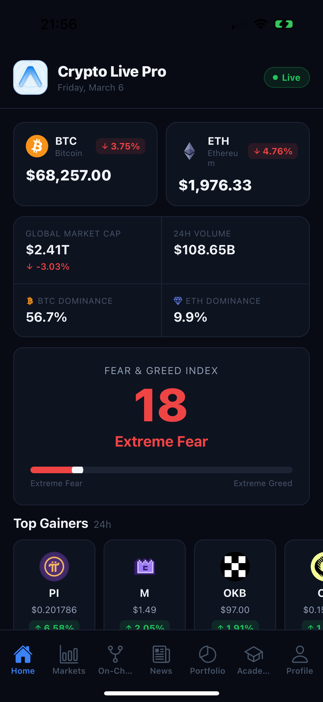
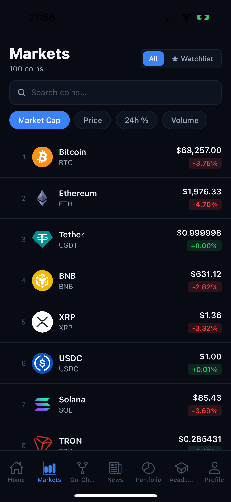
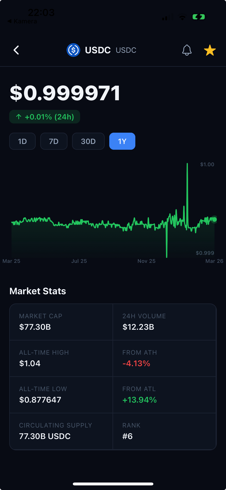
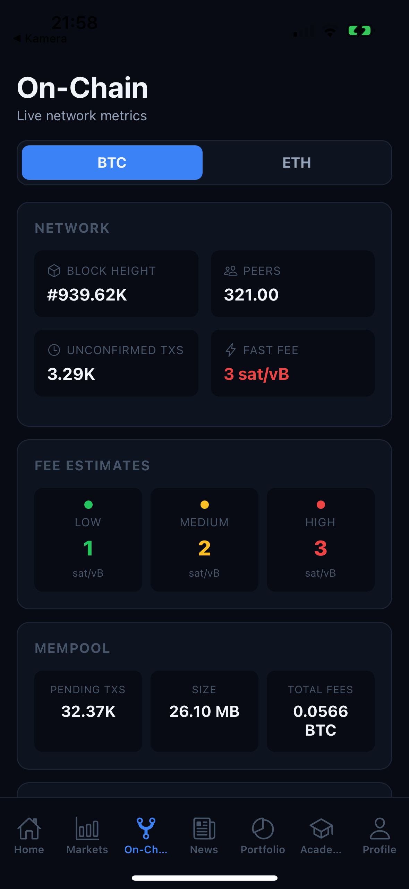
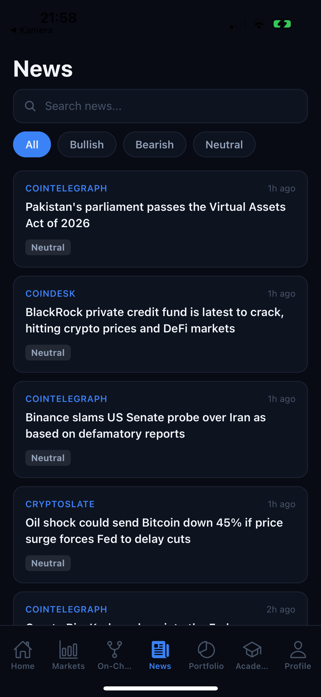
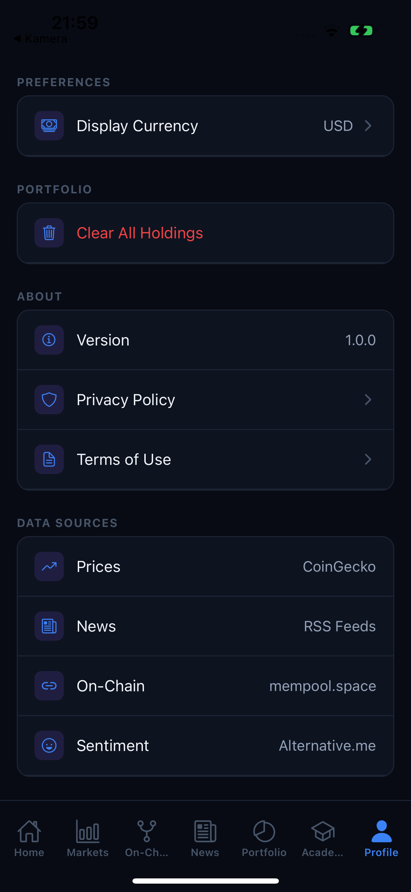

# Crypto Live Pro

A real-time cryptocurrency tracking app for iOS and Android, built with React Native and Expo. Live prices, on-chain analytics, aggregated news, portfolio tracking, and a crypto education hub — backed by a custom Node.js microservices layer.

---

## Screenshots

<table>
  <tr>
    <td></td>
    <td></td>
    <td></td>
    <td></td>
    <td></td>
    <td></td>
  </tr>
  <tr>
    <td align="center">Home</td>
    <td align="center">Markets</td>
    <td align="center">Coin Detail</td>
    <td align="center">On-Chain</td>
    <td align="center">News</td>
    <td align="center">Profile</td>
  </tr>
</table>

---

## Features

| Tab | Description |
|-----|-------------|
| **Home** | Global market cap, BTC/ETH dominance, Fear & Greed index, top movers, trending coins |
| **Markets** | Live coin list with search, sort, and watchlist filter |
| **Coin Detail** | SVG price chart with 1D / 7D / 30D / 1Y range, market stats, price alerts, watchlist toggle |
| **On-Chain** | BTC/ETH network stats — hashrate, fees, mempool, difficulty adjustment |
| **News** | Aggregated news from CoinDesk, Cointelegraph, CryptoSlate with search filter |
| **Portfolio** | Holdings tracker with cost basis, real-time P&L, and price alerts |
| **Learn** | Structured modules on blockchain fundamentals with searchable glossary |

---

## Architecture

```
┌─────────────────────────────────────────┐
│         Mobile App  (Expo / RN)         │
│  Home · Markets · News · OnChain · …    │
└──────────────────┬──────────────────────┘
                   │ HTTP
                   ▼
┌─────────────────────────────────────────┐
│            API Gateway  :3000           │
│        /market   /news   /onchain       │
└───────┬──────────────┬──────────────────┘
        │              │               │
        ▼              ▼               ▼
┌──────────────┐ ┌──────────────┐ ┌──────────────┐
│    Market    │ │     News     │ │   OnChain    │
│  Service     │ │   Service    │ │   Service    │
│    :3001     │ │    :3002     │ │    :3003     │
│  TTL cache   │ │  RSS parser  │ │  TTL cache   │
└──────┬───────┘ └──────┬───────┘ └──────┬───────┘
       │                │                │
       ▼                ▼                ▼
  CoinGecko        CoinDesk        BlockCypher
  Alternative.me   Cointelegraph   mempool.space
                   CryptoSlate
```

The mobile app communicates only with the API gateway. Third-party API calls, caching, and key management happen exclusively on the backend. When `EXPO_PUBLIC_API_URL` is not set, the app falls back to direct API calls (native only — CORS restrictions apply on web).

### Backend Services

All four services are written in **pure Node.js with zero npm dependencies** — only built-in `node:http` and the native `fetch` API.

| Service | Port | Responsibility |
|---------|------|----------------|
| **API Gateway** | 3000 | Routes requests by prefix, handles CORS |
| **Market Service** | 3001 | CoinGecko + Fear & Greed proxy with tiered TTL caching |
| **News Service** | 3002 | RSS aggregator (no API key required) |
| **OnChain Service** | 3003 | BlockCypher + mempool.space aggregation |

### Mobile Layers

**Service layer** — Pure async functions. Each file maps to one data source, fetches, parses, and returns typed data. No side effects.

**Store layer** — Zustand v5 stores own all application state, persisted via AsyncStorage. Components never call services directly.

**UI layer** — Expo Router file-based tabs. Each tab reads from the store and imports only from its own `components/<tab>/` folder.

---

## Tech Stack

| Concern | Technology |
|---------|------------|
| Framework | Expo SDK 54 + React Native 0.81 |
| Language | TypeScript |
| Navigation | Expo Router v6 (file-based) |
| State | Zustand v5 + AsyncStorage persistence |
| Charts | react-native-svg (custom SVG, no charting library) |
| Backend | Node.js 20.6+ (zero dependencies) |
| Market data | CoinGecko REST API |
| News | CoinDesk, Cointelegraph, CryptoSlate RSS |
| On-chain | BlockCypher API + mempool.space API |
| Sentiment | Alternative.me Fear & Greed API |

---

## Getting Started

### Prerequisites

- Node.js **20.6+** (required for `--env-file` flag used by the backend)
- Expo Go app on your phone (iOS or Android)

### Install

```bash
git clone https://github.com/azrakarakaya1/crypto-live-pro.git
cd crypto-live-pro
npm install
```

### Environment variables

Create a `.env` file at the project root:

```env
# Optional — only needed if you want news via direct CryptoPanic fallback
EXPO_PUBLIC_CRYPTOPANIC_KEY=your_key

# Recommended — point to your running backend gateway
# Use localhost for web/simulator, your machine's local IP for physical devices
EXPO_PUBLIC_API_URL=http://localhost:3000
# EXPO_PUBLIC_API_URL=http://192.168.x.x:3000  # physical device
```

### Run the backend

```bash
cd backend
node --env-file=.env run-all.js
```

This starts all four services in a single process. Visit `http://localhost:3000` to see available routes.

### Run the mobile app

```bash
cd ..
npx expo start --clear
```

Scan the QR code with Expo Go on your phone. Make sure your phone and computer are on the same Wi-Fi network, and set `EXPO_PUBLIC_API_URL` to your machine's local IP address (not `localhost`) for physical devices.

---

## Project Structure

```
crypto-live-pro/
├── app/
│   ├── _layout.tsx              # Root stack layout
│   ├── coin/[id].tsx            # Coin detail screen
│   └── (tabs)/
│       ├── index.tsx            # Home
│       ├── markets.tsx          # Markets
│       ├── onchain.tsx          # On-Chain Analytics
│       ├── news.tsx             # News
│       ├── portfolio.tsx        # Portfolio
│       ├── learn.tsx            # Learn Hub
│       └── profile.tsx          # Profile
├── backend/
│   ├── gateway.js               # API Gateway (:3000)
│   ├── run-all.js               # Dev runner (single process)
│   ├── lib/server.js            # Minimal HTTP server factory
│   └── services/
│       ├── market.js            # Market Service (:3001)
│       ├── news.js              # News Service (:3002)
│       └── onchain.js           # OnChain Service (:3003)
├── components/
│   ├── home/                    # Home tab components
│   ├── markets/                 # Markets + LineChart
│   ├── onchain/                 # On-chain cards
│   ├── news/                    # News cards + filter bar
│   ├── portfolio/               # Portfolio components + AddAlertModal
│   ├── learn/                   # Learn Hub + content data
│   └── ui/                      # Shared primitives (CoinRow etc.)
├── services/
│   ├── coingecko.ts             # CoinGecko API (gateway-aware)
│   ├── cryptopanic.ts           # News aggregator (gateway-aware, RSS fallback)
│   ├── feargreed.ts             # Fear & Greed API (gateway-aware)
│   └── onchain.ts               # On-chain API (gateway-aware)
├── store/
│   ├── useMarketStore.ts        # Coins, global data, watchlist
│   ├── usePortfolioStore.ts     # Holdings + price alerts
│   └── useSettingsStore.ts      # Currency preference
├── hooks/
│   ├── useInitMarketData.ts     # Fetches all market data on mount
│   ├── useNews.ts               # News fetch hook
│   └── useFormatPrice.ts        # Currency-aware price formatter
├── types/index.ts               # All shared TypeScript types
├── constants/Colors.ts          # Dark purple theme tokens
└── utils/formatters.ts          # Price, percent, number formatters (null-safe)
```

---

## Roadmap

- [x] Home, Markets, Portfolio, Learn Hub, Profile
- [x] On-Chain Analytics (BTC + ETH)
- [x] News aggregator with search filter
- [x] Coin detail with SVG price chart (1D / 7D / 30D / 1Y)
- [x] Microservices backend with API gateway
- [x] Price alerts (set from coin detail, triggered on price check)
- [x] Multi-currency support (USD, EUR, GBP, JPY, BTC)
- [x] Persistent portfolio, watchlist, and settings (AsyncStorage)
- [ ] Push notifications for price alerts
- [ ] AI news summaries (GPT-4o-mini)
- [ ] Supabase auth + cloud portfolio sync
- [ ] RevenueCat subscriptions

---

## Contact

For questions, feedback, or collaboration: **azrakarakaya09@gmail.com**

---

## License

MIT
