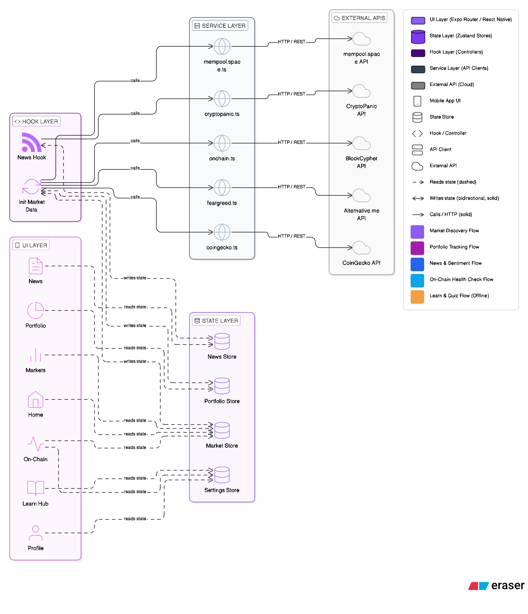

# Crypto Live Pro

A real-time cryptocurrency tracking app for iOS and Android, built with Expo. Live prices, market intelligence, news sentiment, portfolio tracking, and a built-in crypto education hub — all in one dark-themed, fast interface.

---

## Screenshots

> _(coming soon)_

---

## System Architecture



---

## Features

| Tab | Description |
|-----|-------------|
| **Home** | Global market cap, BTC/ETH dominance, Fear & Greed index, trending coins |
| **Markets** | Live coin list with search and sort, paginated from CoinGecko |
| **Portfolio** | Track holdings, cost basis, and real-time P&L |
| **News** | Crypto news feed with positive/negative/neutral sentiment badges |
| **Learn** | Structured modules, chapter readings, glossary, and quizzes |
| **On-Chain** | _(Phase 2)_ Whale tracker, exchange flows, network metrics |
| **Profile** | Currency preference, app settings |

---

## Architecture

The app follows a **microservice-oriented client architecture**: each external data source is encapsulated in its own service module, consumed by isolated Zustand stores, and rendered by tab-specific component trees. No service talks directly to another — all coordination goes through the store layer.

```
┌─────────────────────────────────────────────────────────────────┐
│                        Expo Router (UI Layer)                   │
│                                                                 │
│   Home   Markets   Portfolio   News   Learn   On-Chain   Profile│
│    │        │          │        │       │         │          │  │
└────┼────────┼──────────┼────────┼───────┼─────────┼──────────┼──┘
     │        │          │        │       │         │          │
┌────▼────────▼──────────▼────────▼───────┼─────────┼──────────▼──┐
│                      Store Layer (Zustand)                       │
│                                                                  │
│   useMarketStore          usePortfolioStore   useSettingsStore   │
│   ├── coins               ├── holdings        └── currency       │
│   ├── globalData          ├── alerts                             │
│   ├── trending            └── (persisted)                        │
│   ├── fearGreed                                                  │
│   └── watchlist                                                  │
└──────────────┬────────────────────────────────────────────────── ┘
               │  reads / writes
┌──────────────▼──────────────────────────────────────────────────┐
│                     Service Layer                               │
│                                                                 │
│  ┌─────────────────┐  ┌─────────────────┐  ┌────────────────┐  │
│  │  coingecko.ts   │  │  cryptopanic.ts │  │  feargreed.ts  │  │
│  │                 │  │                 │  │                │  │
│  │ • getCoins()    │  │ • getNews()     │  │ • getFear      │  │
│  │ • getGlobal()   │  │                 │  │   Greed()      │  │
│  │ • getTrending() │  │                 │  │                │  │
│  │ • getCoinDetail │  │                 │  │                │  │
│  │ • getCoinChart()│  │                 │  │                │  │
│  └────────┬────────┘  └────────┬────────┘  └───────┬────────┘  │
└───────────┼────────────────────┼───────────────────┼───────────┘
            │                    │                   │
┌───────────▼────────────────────▼───────────────────▼───────────┐
│                      External APIs                              │
│                                                                 │
│   CoinGecko API          CryptoPanic API    Alternative.me      │
│   (market data,          (crypto news +     (Fear & Greed       │
│    prices, charts)        sentiment votes)   Index)             │
│                                                                 │
│                    ┌────────────────┐                           │
│                    │  OpenAI API    │  ← Phase 2 (AI summaries) │
│                    │  (GPT-4o-mini) │                           │
│                    └────────────────┘                           │
└─────────────────────────────────────────────────────────────────┘
```

### Layer responsibilities

**Service layer** — Each file maps to exactly one external API. Services are pure async functions: they fetch, parse, and return typed data. They have no side effects and no knowledge of UI or state.

**Store layer** — Zustand stores own application state. Hooks like `useInitMarketData` call services on a polling interval (60 s) and write results into the store. Components never call services directly.

**UI layer** — Expo Router file-based tabs. Each tab imports only from its own `components/<tab>/` folder and reads from the store. Cross-tab shared primitives live in `components/ui/`.

---

## Tech Stack

| Concern | Library |
|---------|---------|
| Framework | Expo SDK 54 + React Native 0.81 |
| Navigation | Expo Router v6 (file-based) |
| State | Zustand v5 |
| Animations | React Native Reanimated v4 |
| Prices | CoinGecko REST API (free tier) |
| News | CryptoPanic Developer API |
| Sentiment index | Alternative.me Fear & Greed API |
| AI summaries | OpenAI GPT-4o-mini _(Phase 2)_ |
| Payments | RevenueCat _(Phase 3)_ |
| Auth | Supabase Auth _(Phase 3)_ |

---

## Getting Started

### Prerequisites

- Node.js 20+
- Expo CLI: `npm install -g expo-cli`
- iOS Simulator or Android Emulator (or Expo Go on device)

### Install

```bash
git clone https://github.com/azrakarakaya1/crypto-live-pro.git
cd crypto-live-pro
npm install
```

### Environment variables

Create a `.env` file at the project root:

```env
EXPO_PUBLIC_CRYPTOPANIC_KEY=your_cryptopanic_api_key
```

CoinGecko and Alternative.me endpoints used here require no API key on the free tier.

### Run

```bash
# iOS simulator
npm run ios

# Android emulator
npm run android

# Web (limited)
npm run web
```

---

## Project Structure

```
crypto-live-pro/
├── app/
│   ├── _layout.tsx          # Root layout (fonts, safe area)
│   └── (tabs)/
│       ├── _layout.tsx      # Tab bar definition
│       ├── index.tsx        # Home
│       ├── markets.tsx      # Markets
│       ├── portfolio.tsx    # Portfolio
│       ├── news.tsx         # News
│       ├── learn.tsx        # Learn Hub
│       ├── onchain.tsx      # On-Chain (Phase 2)
│       └── profile.tsx      # Profile
├── components/
│   ├── home/                # Home tab components
│   ├── markets/             # Markets tab components
│   ├── portfolio/           # Portfolio tab components
│   ├── news/                # News tab components
│   ├── learn/               # Learn Hub components + content data
│   ├── profile/             # Profile tab components
│   └── ui/                  # Shared primitives (CoinRow, etc.)
├── services/
│   ├── coingecko.ts         # CoinGecko API
│   ├── cryptopanic.ts       # CryptoPanic API
│   └── feargreed.ts         # Alternative.me Fear & Greed API
├── store/
│   ├── useMarketStore.ts    # Global market + watchlist state
│   ├── usePortfolioStore.ts # Holdings + price alerts state
│   └── useSettingsStore.ts  # User preferences
├── hooks/
│   ├── useInitMarketData.ts # Polling hook for market data
│   └── useNews.ts           # News fetch hook
├── types/index.ts           # All shared TypeScript types
├── constants/Colors.ts      # Dark purple theme tokens
└── utils/formatters.ts      # Currency, percent, number formatters
```

---

## Roadmap

- [x] **Phase 1 — MVP**: Home, Markets, Portfolio, Learn Hub, Profile
- [ ] **Phase 2 — Features**: On-Chain analytics, AI news summaries, push notifications
- [ ] **Phase 3 — Pro**: RevenueCat subscriptions, Supabase auth, sentiment dashboard
- [ ] **Phase 4 — Launch**: Beta, ASO, public release

---

## License

MIT
